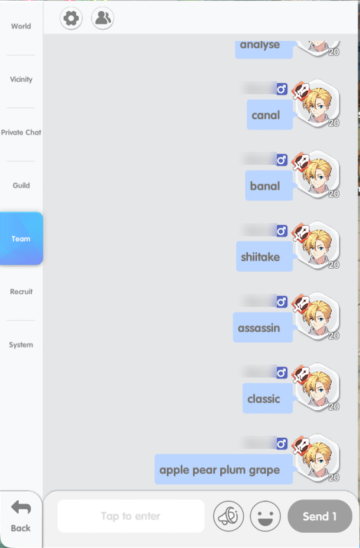
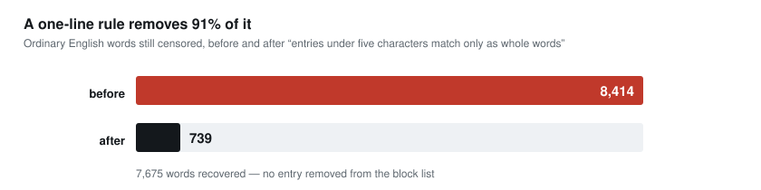
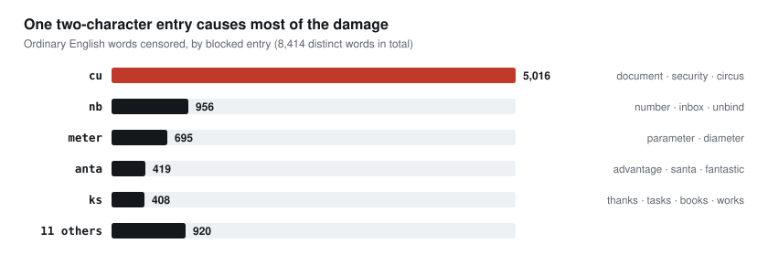
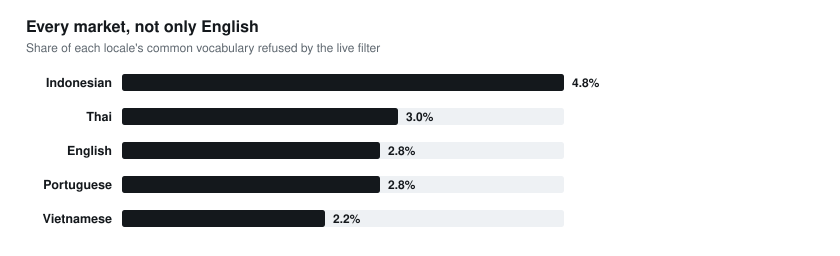

# RRG-chatguard

Accuracy audit of the **Ragnarok: Rebirth Global** chat filter, and a fix.

| The player types | What the filter finds inside it | What happens |
|---|---|---|
| `thank` | nothing from its word list | the message is delivered |
| `thanks` | `ks`, an entry on its word list | **the message is blocked** |

The filter searches for each banned word **anywhere in a message, including
inside longer words**. Adding the letter `s` to `thank` creates the letters
`ks`, so the filter blocks the whole message.

The same thing happens to `document`, `security`, `number`, `advantage`,
`parameter`, `campus` and `vacation`. The live service blocked all of them
during this audit.

**15,307** messages tested · **343** ordinary words confirmed blocked ·
**8,414** ordinary English words affected

**[→ Read the 6-page report](docs/chat-filter-audit-report.pdf)**  ·
[one-pager](docs/chat-filter-defect-report.pdf) · [markdown](REPORT.md)



**How it was measured.** A system drove the normal game client on a live
account. It typed each test word into a private Team channel, clicked send,
then read the chat history back to see whether the message appeared. If it did
not appear, the server blocked it. It ran on its own for 33 hours, about one
message every 8 seconds. It used a normal player account and the retail client,
nothing else. The sender name is blurred in the screenshot.

<br clear="all">

> **Content notice.** This repository audits a profanity filter. The entries
> named in this README are the short ones that cause the false positives. The
> full list, which includes slurs, is in the report and in `findings/`.

---

## The fix

> **Rule: if an entry is shorter than 5 characters, the filter should match it
> only as a complete word, not inside a longer word.**

With this rule in place:

- A player who types `cu` on its own is still blocked. Nothing is removed from
  the word list.
- A player who types `document` is no longer blocked.
- Entries of 5 characters or more work exactly as they do today.

This one rule fixes 91% of the affected words.



### Four ways to fix it

| | What you change | Effort |
|---|---|---|
| **A** | Add [`findings/words-to-allow.txt`](findings/words-to-allow.txt) to your exception list. 343 words, no code | Hours |
| **B** | Add [`fix/rescue.py`](fix/rescue.py) at one place in your code | 1 day |
| **C** | Add the 5-character rule above to your matcher | 1 to 2 days |
| **D** | Replace your matcher with [`engine/`](engine/) | 1 to 2 weeks |

**No option removes any word from your block list.** Each one only stops the
filter from blocking ordinary words.

Option B is three lines, at the point where your code has already decided to
block a message:

```python
from rescue import Rescue
rescue = Rescue("allowlist-en.txt")        # run once, when the server starts

if rescue.is_rescued(text, match_start, match_end):
    pass          # this is an ordinary word, so deliver the message
else:
    block()       # your existing behaviour, unchanged
```

---

## Why it happens

`ks` is one of the banned entries. We tested it by putting those two letters
inside a made-up word, so that a block could only be caused by the letters
themselves:

| We sent this message | What happened | What this shows |
|---|---|---|
| `ks` | blocked | `ks` is on the word list |
| `xxksxx` | blocked | the filter finds `ks` inside a longer word |
| `qwksqw` | blocked | the same, with different surrounding letters |
| `xxkxx` | delivered | the letter `k` on its own is fine |
| `xxsxx` | delivered | the letter `s` on its own is fine |
| `xxskxx` | delivered | the same two letters reversed are fine |

Only the two letters `ks`, in that order, cause a block. The surrounding
letters make no difference.

The word list is mostly Brazilian Portuguese, and its shortest entries are two
letters long. Those two letters are a rude word in Portuguese, and an ordinary
part of many words in English, Indonesian, Thai and Vietnamese.



`cu` is a rude word in Portuguese. In English, the same two letters sit in the
middle of `document`.



---

## What you would be installing

| file | lines | what it does |
|---|---|---|
| [`fix/rescue.py`](fix/rescue.py) | 138 | Option B. The whole fix. |
| [`engine/chatguard.py`](engine/chatguard.py) | 676 | Option D. The replacement matcher. |
| [`engine/shadow.py`](engine/shadow.py) | 147 | Runs a new filter next to your current one and compares the two answers. Your filter stays in charge. |

961 lines in total. Python standard library only, no outside packages, MIT
licensed.

**Option A installs nothing at all.** It is a text file of 343 words.

We do not ship a word list. Your word list stays your own. What this audit
found is a problem in the matching, not in your words.

If your review process wants it, `python3 tools/verify_safe.py` lists the
imports and file operations in each of the three files.

---

## How to roll it out safely

1. **Compare first.** `engine/shadow.py` runs the new filter next to your
   current one and records where the two answers differ. Players see no
   change, because your filter still decides.
2. **Check each difference.** Every difference should be a message that your
   filter blocks today, and the new filter would deliver. If any message goes
   the other way, something is wired wrong: no option here adds blocking.
3. **Turn it on.** Options A and B are separate. You can ship either one first.

---

## What is in this repository

| | |
|---|---|
| [`findings/`](findings/) | the evidence. Word lists, `findings.json`, and all 15,307 test records. ⚠ contains profanity |
| [`fix/`](fix/) | `rescue.py`, the 473,532-word exception list, deployment notes |
| [`engine/`](engine/) | optional replacement matcher, 55 tests, 29 conformance vectors |
| [`tools/`](tools/) | the programs used to produce and check everything above |
| [`docs/`](docs/) | PDFs, adoption notes, background research, and [suggestions](docs/SUGGESTIONS.md) that are separate from the audit |

```sh
python3 tools/verify_safe.py       # imports and file operations, per file
python3 engine/tests/test_all.py   # 55 tests
python3 tools/conformance.py       # 29 conformance vectors
python3 tools/check_numbers.py     # every number in the documents matches the evidence
```

You can confirm the problem yourself in ten seconds, using nothing from this
repository: type `thank` in the game, then type `thanks`.

<details>
<summary><b>How the audit was done, and what it does not cover</b></summary>

<br>

The audit sees exactly what a player sees. It used a normal player account and
the retail client: no modified client, no packets sent directly, and no access
to server code or configuration.

Three rules decided what went into this report.

1. **We name an entry only after testing it on its own.** For each one, we put
   the letters inside a made-up word. We also sent each letter separately. If a
   single letter was blocked too, we dropped that candidate.
2. **One test is not a result.** We measured how often our own detection was
   wrong: 6 wrong readings out of 491, which is 1.2%. Every word in this report
   was blocked in at least two separate tests.
3. **A message that was never sent does not count as delivered.** Sometimes the
   text did not reach the input box, so no message went out. We retried those
   words. 15 stayed unresolved. We also re-tested 250 words that looked fine,
   and found no blocked words that we had missed.

**What this audit does not cover.** There may be more than the 16 entries we
found. We can only find an entry if its letters appear in one of the 11,868
strings we tested. The figure of 8,414 affected words is calculated, not
measured: we applied the confirmed entries to a dictionary. The 343 measured
words are kept in a separate file. We did not test Korean, Chinese or Japanese
vocabulary. All results describe the service on 11 and 12 September 2026.

</details>
